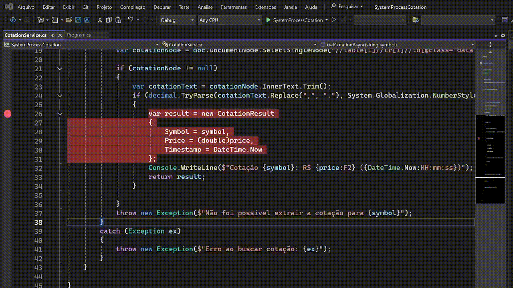

# System Process Cotation



Monitoração de preços que envia alertas por email de quando comprar/vender ao atingir um limite.

### features extras:
+ mensagens mais detalhadas no console
+ sistema só envia um novo alerta se o preço mudar, evitando spam
+ intervalo para as verificações da cotação

### como executar
dotnet run **Ativo preçoVenda preçoCompra**

```bash
dotnet run PETR4 22.67 22.59
```

### Gerar executável
```bash
dotnet publish -c Release -r win-x64 --self-contained true /p:PublishSingleFile=true
```

### Executar o arquivo
```bash
bin\Release\net9.0\win-x64\publish\SystemProcessCotation.exe PETR4 35.00 30.00
``` 

### Executando no Windows através do powershell
```powershell
Set-ExecutionPolicy Unrestricted
``` 

### Executar com um script pronto
```powershell
.\script.ps1 PETR4 35.00 30.00
``` 

### Confiuração

Configure o SMTP renomeando `.env.example` para `.env` e edite os campos.
