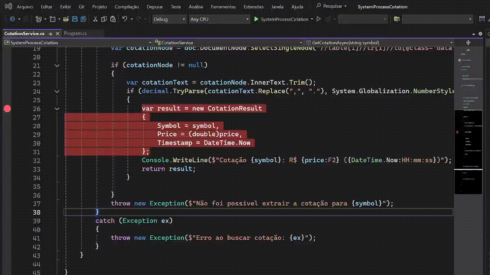

# System Process Cotation

> Event-driven stock-price monitor built in **.NET 9 / C#**. It continuously tracks an asset's price and sends a **buy/sell email alert** when the price crosses a target threshold.



---

## What this project demonstrates

Beyond the feature itself, the codebase is a compact showcase of production-style backend patterns:

- **Event-driven pipeline** — three decoupled background workers communicating over a message bus (producer → analyzer → notifier).
- **Pub/Sub messaging** — an SNS (topics) + SQS (queues) event bus, runnable fully offline via **LocalStack** or against real AWS.
- **Clean architecture & DI** — every component sits behind an interface and is wired through the .NET Generic Host container; business rules are isolated from I/O.
- **Stateful deduplication** — **Redis** stores the last alert price and a cooldown window, so users aren't spammed with repeated alerts.
- **Graceful degradation** — with no SMTP configured, alerts are logged instead of emailed, so the whole system is demoable without credentials.
- **Containerized** — a single `docker compose up` spins up the app, Redis, and the LocalStack AWS emulator.

---

## Architecture

```
                 ┌──────────────────┐   publishes   ┌──────────────┐
  price source   │  CotationWorker  │ ────────────▶ │   cotations  │
 (web scrape) ──▶│    (producer)    │               │   (bus topic)│
                 └──────────────────┘               └──────┬───────┘
                                                           │ subscribes
                                                           ▼
                 ┌──────────────────┐   Redis dedup  ┌──────────────┐
    email    ◀───│ NotificationWkr  │ ◀───────────── │ TradingWorker│
   (MailKit)     │   (consumer)     │   publishes    │(analyzer)    │
                 └──────────────────┘  ┌──────────┐  └──────┬───────┘
                          ▲            │  alerts   │◀────────┘
                          └────────────│ (bus topic)│
                                       └──────────┘
```

1. **CotationWorker** (producer) — on a fixed interval, fetches the asset's current price and publishes it to the `cotations` channel.
2. **TradingWorker** (analyzer) — subscribes to `cotations`, applies the buy/sell rule, filters out repeats via a Redis cooldown, and publishes qualifying `alerts`.
3. **NotificationWorker** (consumer) — subscribes to `alerts` and sends the email (or logs it if SMTP is off).

---

## Tech stack

| Area | Technology |
|------|-----------|
| Runtime | .NET 9, C# |
| Hosting / DI | `Microsoft.Extensions.Hosting` (Generic Host, `BackgroundService`) |
| Messaging | AWS **SNS + SQS** (`AWSSDK`), LocalStack for local dev |
| State | **Redis** (`StackExchange.Redis`) |
| Email | **MailKit** (SMTP) |
| Price scraping | `HttpClient` + **HtmlAgilityPack** |
| Config | `appsettings.json`, command-line args, `.env` (`DotNetEnv`) |
| Infra | Docker, Docker Compose |

> **Note on the price source:** prices are scraped from a public Brazilian equities page (Fundamentus). Scrapers are inherently fragile — treat the fetch layer as a swappable adapter behind `ICotationService`, and plug in a proper market-data API for production use.

---

## Getting started

### Option 1 — Docker Compose (recommended)

Brings up the worker, Redis, and LocalStack together:

```bash
docker compose up --build
```

The default thresholds in `docker-compose.yml` are set to force a demo **SELL** alert. Adjust the asset and prices there for your own scenario.

### Option 2 — Run locally with .NET

You'll need the **.NET 9 SDK**, plus Redis and LocalStack (or real AWS) reachable at the addresses in `appsettings.json`.

```bash
cd SystemProcessCotation

# Usage: dotnet run <ASSET> <sellPrice> <buyPrice>
dotnet run PETR4 22.67 22.59
```

Command-line arguments take priority; if omitted, values are read from the `Trading` section of `appsettings.json`.

### Build a standalone executable

```bash
dotnet publish -c Release -r win-x64 --self-contained true /p:PublishSingleFile=true

# then run it:
bin\Release\net9.0\win-x64\publish\SystemProcessCotation.exe PETR4 35.00 30.00
```

### Run via the PowerShell helper script

```powershell
Set-ExecutionPolicy Unrestricted   # once, if scripts are blocked
cd .\SystemProcessCotation\
.\script.ps1 PETR4 32.54 32.51
```

---

## Configuration

### Trading & infrastructure — `appsettings.json`

```jsonc
{
  "Aws":   { "Region": "us-east-1", "ServiceUrl": "http://localhost:4566" },
  "Redis": { "ConnectionString": "localhost:6379" },
  "Trading": {
    "StockSymbol": "PETR4",
    "PriceToSell": 999.0,     // alert when price >= this
    "PriceToBuy":  0.01,      // alert when price <= this
    "CheckIntervalMs": 5000   // polling interval
  }
}
```

- Leave `Aws:ServiceUrl` empty to target **real AWS** (uses the default credential chain); set it to the LocalStack URL for offline runs.

### Email (SMTP) — optional

SMTP is **optional**. Without it, alerts are written to the log instead of emailed. To enable email, copy `.env.example` to `.env` and fill in:

```env
HOST=smtp.gmail.com
PORT=587
USERNAME=your_user
PASSWORD=your_app_password
FROM=from@example.com
TO=to@example.com
```

---

## Project structure

```
SystemProcessCotation/
├── Program.cs                # Host + DI wiring, config resolution
├── Workers/                  # BackgroundService pipeline
│   ├── CotationWorker.cs     #   producer: fetch & publish prices
│   ├── TradingWorker.cs      #   analyzer: buy/sell rule + Redis dedup
│   └── NotificationWorker.cs #   consumer: send/log email
├── Bus/                      # SNS/SQS event bus + provisioning
├── Services/                 # Cotation, Trading, Email, Redis state, Config
├── Interfaces/               # Contracts for every service (clean architecture)
├── Models/                   # CotationResult, TradingAlert
├── Utils/                    # Command-line parsing
└── appsettings.json
```

---

## License

Released for portfolio and educational purposes. Feel free to explore and adapt.
